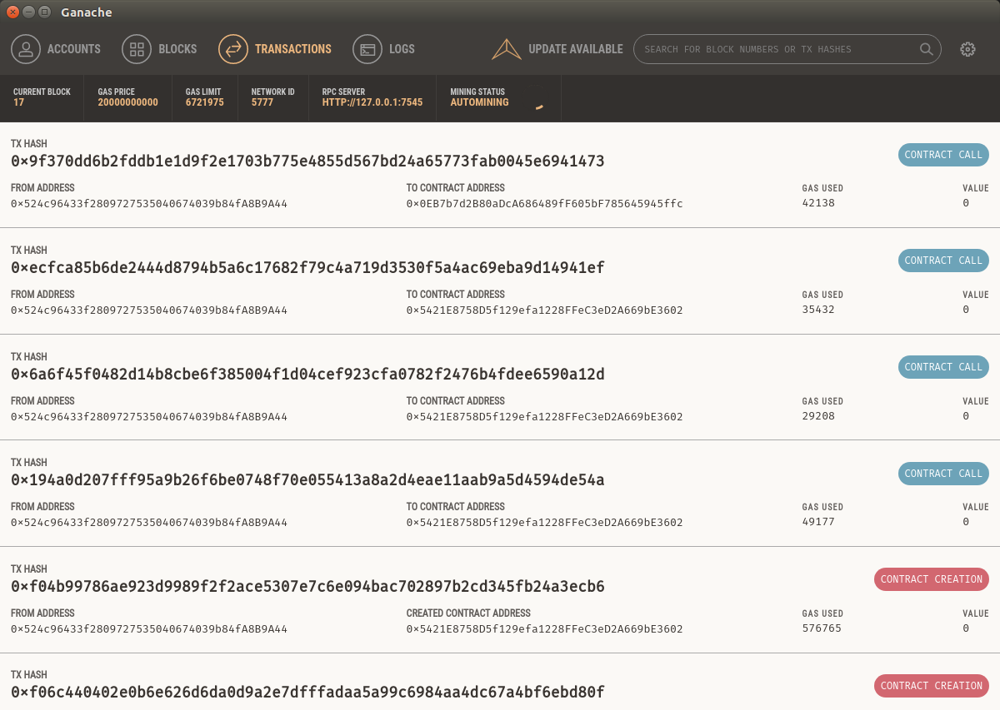

## solidity-ide-modulo1

### **Actividad 1** - Ejercicio para la comprobación de que el entorno ha sido correctamente instalado.

#### Tutorial Truffle Pet Shop

Se indican los pasos del tutorial más interesantes:

  1. Se crea el proyecto con el comando `truffle unbox pet-shop`
  
  2. Se crea el contrato Adoption con las funciones correspondientes
  3. Hemos compilado el contrato con el comando `truffle compile`
  4. Se crea el fichero para migrar el contrato de Adoption y se ejecuta `truffle migrate`
  5. Previo al paso anterior, se ha tenido que ejecutar la aplicación Ganache en el sistema para simular una red Ethereum.
  
  6. Se crea un contrato de test llamado `TestAdoption.sol` para validar nuestro contrato.
  7. Se ejecutan los test con el comando `truffle test`
  8. Se abre los recursos web que utilizan `web3.js` y se completa el fichero `src/js/app.js` con los pasos que indica el tutorial
  9.  Nos logeamos con la extensión `MetaMask` apuntando a la dirección y puerto local de Ganache
  11. Levantamos los recursos web a través del servidor de desarrollo con el comando `npm run dev`
  12. Ya podemos acceder desde el navegador a nuestra Dapp e interactuar con ella, adoptando así a los animales que se deseen.
  

#### Preguntas relacionadas

+ Comprobar que existe conexión a un nodo
  Si esta conectado a un nodo
  

+ Comprobar si está o no sincronizando nuevos bloques. ¿Por qué?
  No está sincronizando bloques, ya que nos devuelve el booleano false. Si lo estuviese, tendría que retornar un objeto con la información del bloque que se está sincronizando.
  

+ Balance de la cuenta que ha desplegado el contrato en la blockchain
  El balance de la cuenta es de 99184298300000000000 wei.
  

+ Address de la cuenta número 3 de Ganache o ganache-cli
  En la variable `web3.eth.accounts` se encuentra el array de direcciones de Ganache. Elegimos el elemento que tiene indice 2 ya que será la tercera dirección.
  

+ Numero de bloque en el que se encuentra blockchain en ese instante. ¿Por qué?
  El numero de bloque en el instante de la captura es de 14. Este es un numero consecutivo que empezó en 0 y se ha ido incrementado a medida que se han realizado transacciones en Ganache.
  

+ Dirección del host de la blockchain
  A continuación se muestral la dirección del host al que estamos conectados:
  

+ Acceda a ethgassstation y convierta del gas en ese instante a Ether.
  El precio del gas en este instante es de 6Gwei. Utilizamos el comando `web3.fromWei(cantidad, unidad)` para convertirlo a wei.
  

### **Actividad 2** - Ejercicios de Solidity

Se ha ejecutado Ganache en la máquina virtual de Ubuntu para desplegar una red Ethereum local.

Asimismo, se han añadido los 3 smart contract en el IDE Remix y se ha configurado para que apunte a la red de Ganache `http://127.0.0.1:7545`

#### Issue your token

Una vez compilado el contrato con Remix, podemos desplegarlo en la red de Ganache indicandole el valor del parámetro `uint initialSupply`. Dicho valor, se almacenará en la variable `balanceOf` reservada para la dirección de la cuenta del creador del contrato (`msg.sender`).

A partir de ese momento, el contrato queda accesible en la red, y la cuenta del owner, podrá hacer uso de la función `transfer()` para enviar tokens a otras cuentas, siempre y cuando tenga disponible.

El resto de cuentas que vayan obteniendo tokens a través de transferencias, podrán hacer uso también de dicha función.

#### Kickstart your project

Para desplegar este contrato, necesitamos previamente la dirección de un contrato de tipo `token`. En este caso la dirección del contrato es: `0x9161468b04ebe14550dc1bf64bbad8de080c4342`

Además, es necesario indicar al constructor del contrato la dirección donde se va a depositar los Ethers en caso de que el proyecto alcance el objetivo, así como especificar la cantidad buscada, la duración del crowdsale y el precio de cada token en ether.

En nuestro caso hemos utilizado los siguientes parámetros:
- `address ifSuccessfulSendTo` -> 0x83fced091b8d4f76eea90e1f113621d486bbeaed
- `uint fundingGoalInEthers` -> 40
- `uint durationInMinutes` -> 3
- `uint etherCostOfEachToken` -> 1 
- `address addressOfTokenUsedAsReward` -> 0x9161468b04ebe14550dc1bf64bbad8de080c4342
    
Una vez creado el contrato, los participantes tienen 3 minutos para llegar al objetivo de vender los 100 ethers. Para ello, los participantes envían ethers a la dirección del contrato y a partir del momento en el que se llegue al objetivo, si también ha expirado el tiempo de duración del crowsale, el beneficiario tiene la opción de retirar el dinero.

En caso contrario, si no se llega al objetivo, los participantes podrán accionar sobre el contrato para recuperar el dinero invertido.

#### Start your organization

En este fichero se definen 2 contratos "padre" que son `owned` y `tokenRecipient`, los cuales van a ser heredados por el contrato llamado `Congress`.

El creador del contrato será almacenado como `owner` del mismo y podrá delegar su rol a otra dirección cuando él desee a través del método `transferOwnership()`. En la creación, tendrá que indicar las reglas del congreso: minutos de un debate, quorum mínimo...

Además, el owner podrá dar de alta los distintos miembros del congreso, así como borrarlos. Estas acciones solo las podrá hacer él. Además, podrá cambiar las reglas configuradas en el congreso siempre que quiera.

Por otra parte, los miembros del congreso tendrán el método `newProposal()` para crear propuestas que serán votadas por otros miembros a través de la función `vote()`.

Por último, la acción `executeProposal()` podrá ser ejecutada por cualquiera y servirá para valorar si una propuesta ha sido aprobada por la mayoría establecida o no.

### Autor
- Javier Gasso

